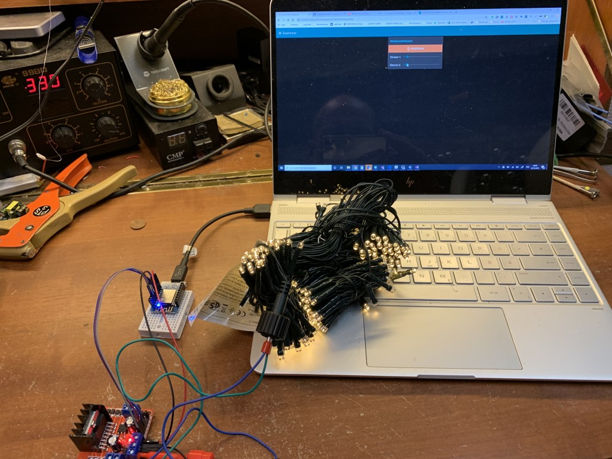

# esp-christmas-lights
control and dim led bipolar Christmas lights with an H-bridge

## idea and nodes
Christmas Lighs nowerdays often come with a little micro bringing 8 effects. Most of them are crap (why the hell are all dimming effects go down to zero - who likes a dark tree? even for some milliseconds?). If you are lucky the have a memory function (either with an eeprom or build in the micro) and you can have them "always on" even after power off.

But what is most annoying is that there is no simple dimming function. So lets do this

## the task
2100 (3x700) LEDs are much to bright even for a bigger tree. My LEDs are too dense wired that I can take one or two stings out.
So control the internat h-bridge or add a new one to dim the bipolar LED strings down. I had to go for a separate h-bridge because the drivers nowadays have the h-bridge and eeprom included in one controller. I`m using one of the L298 (working up to 36V! 31V is needed here) modules and an wemos-d1-mini and the job is done. The module is intended for DC motors so there are smoothing capacitors included which destroys the sharp signal... something an electronic engineer can perhaps fix. This limits the functionality and sometimes gives a flicker in certain settings but dimming in the needed range works very nicely.

## how it is done
I used the homie [convention esp8266 lib in version 3.0.1](https://homieiot.github.io/homie-esp8266/docs/develop-v3/quickstart/what-is-it/). It took a wile to get used to it (mostly because the docs are a little bit outdated) but in the end a quick and dirty source code is done. A weird mixture of hardware pwm and software switching the polarity. It certainly needs improvement as it sometimes misses the beat (WIFI, mqtt ... takes time) but works as needed

It ended that 2100 LEDs are running on 3-6W power instead 18W before - nice.

## pictures

one version with external h-bridge

one with internal h-bridge and without eeprom. The memory seams to be included in the micro

ttl-timing seams perfect

but not always, see the delay on the second output

not perfect but working

simple flow thanks to the homie convention.

## wiring all together

[this blog entry gave me a quick start](https://lanzerdiy.wordpress.com/2019/01/16/arduino-led-christmas-light-controller/)
Replace the arduino by an EPS8266 and you are done. You can use a current limiting power supply of your choice or tap of the voltage from the included driver/transformer (before the microcontroller do his awfull job).

**BE CARFUL YOU ARE DEALING WITH MAINS POWER! IF YOU HAVE NO EXPERIENCE THIS PROJECT IS NOT FOR YOU, SORRY**

## Node-RED

you need minimum of version 0.0.6 of the homie-convention node in order to work properly (using boolean together with "button as a switch")

[here you find the flow](./Node-RED/flow.json)

## the firmware

everything is included in the repo. Contact me if you need any help.